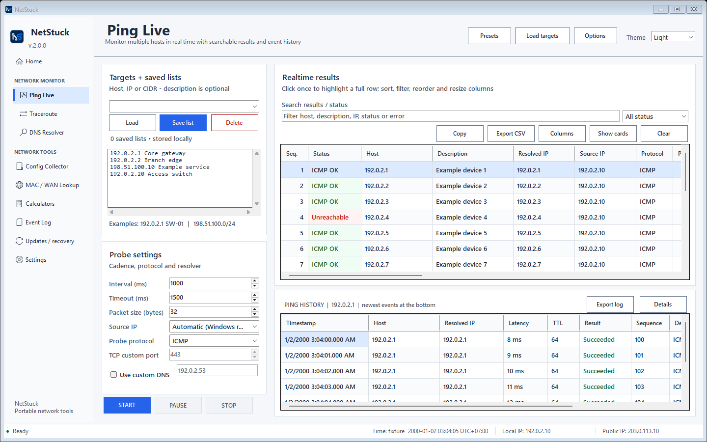
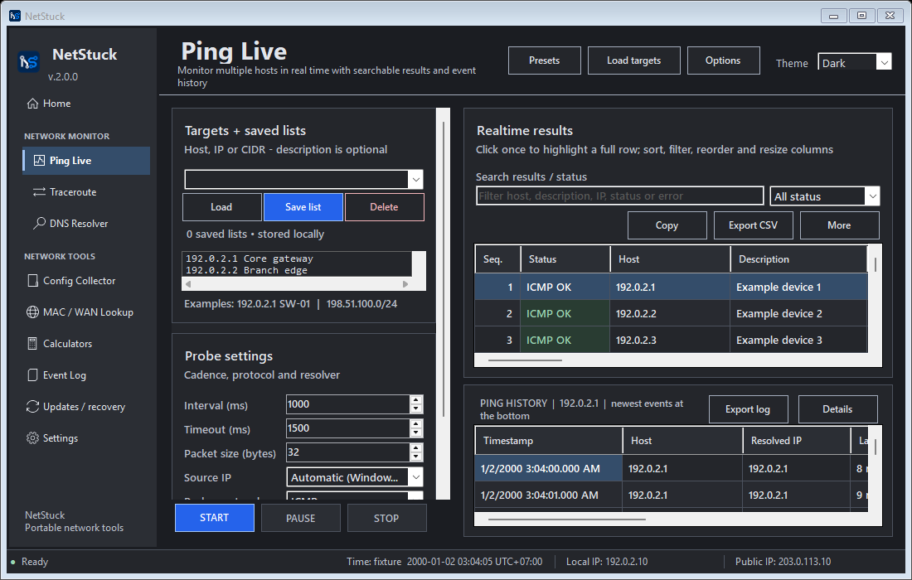

# V2 screenshot evidence

The checked-in selection below contains synthetic fixtures and a frozen clock. Process DPI: 96. Structural rendering uses `DrawToBitmap`; native list examples use `PrintWindow` on the test-owned list HWND composited over the sanitized form. No desktop pixels or operator state are read. These images do not prove physical pointer, screen reader, High Contrast or non-96-DPI acceptance.

Reproduce the full 80-image structural matrix and twelve native list examples after building:

```powershell
.\scripts\Capture-UiV2.ps1 -OutputDirectory artifacts/ui-v2/final -NativePopups
```

[Hash/dimension inventory](evidence.json) covers this 26-image selection. Full display/manual limits are in [the implementation report](../V2_UI_IMPLEMENTATION_REPORT.md).

| Page | Light 1440×900 | Dark 1100×700 |
| --- | --- | --- |
| Home | [Image](screenshots/home-light-1440x900.png) | [Image](screenshots/home-dark-1100x700.png) |
| Ping Live | [Image](screenshots/live-ping-light-1440x900.png) | [Image](screenshots/live-ping-dark-1100x700.png) |
| Traceroute | [Image](screenshots/traceroute-light-1440x900.png) | [Image](screenshots/traceroute-dark-1100x700.png) |
| DNS Resolver | [Image](screenshots/dns-resolver-light-1440x900.png) | [Image](screenshots/dns-resolver-dark-1100x700.png) |
| MAC / WAN Lookup | [Image](screenshots/mac-wan-lookup-light-1440x900.png) | [Image](screenshots/mac-wan-lookup-dark-1100x700.png) |
| Calculators | [Image](screenshots/calculators-light-1440x900.png) | [Image](screenshots/calculators-dark-1100x700.png) |
| Config Collector | [Image](screenshots/config-collector-light-1440x900.png) | [Image](screenshots/config-collector-dark-1100x700.png) |
| Event Log | [Image](screenshots/event-log-light-1440x900.png) | [Image](screenshots/event-log-dark-1100x700.png) |
| Updates / recovery | [Image](screenshots/updates-light-1440x900.png) | [Image](screenshots/updates-dark-1100x700.png) |
| Settings | [Image](screenshots/settings-light-1440x900.png) | [Image](screenshots/settings-dark-1100x700.png) |
| Native Theme list | [Image](screenshots/native-theme-light-1440.png) | [Image](screenshots/native-theme-dark-1100.png) |
| Native Trace protocol list | [Image](screenshots/native-protocol-light-1440.png) | [Image](screenshots/native-protocol-dark-1100.png) |
| Native previous-version list | [Image](screenshots/native-version-light-1440.png) | [Image](screenshots/native-version-dark-1100.png) |




